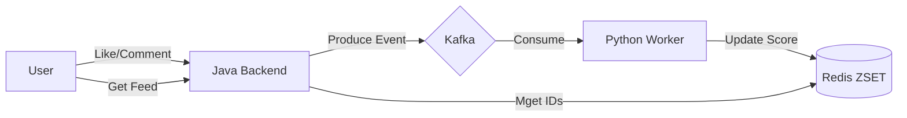

# TECHNICAL SPECIFICATION: HEART-BASED RANKING (GRAVITY ALGORITHM)

**Project:** Hybrid Social Platform  
**Module:** Feed Service & Recommendation (Python Worker)  
**Version:** 3.0 (Hybrid Architecture)  
**Status:** Approved

---

## 1. KIẾN TRÚC TỔNG QUAN (ARCHITECTURE)

Hệ thống sử dụng mô hình **Event-Driven** để tách biệt luồng Ghi (Java) và luồng Tính toán (Python).

*   **Java App:** Chỉ nhận request, lưu DB và bắn Event sang Kafka. Phản hồi User ngay lập tức (Low Latency).
*   **Python Worker (The "Brain"):** Consumer Kafka, chạy thuật toán tính điểm và cập nhật BXH sang Redis.



---

## 2. THUẬT TOÁN VIRAL (GRAVITY FORMULA)

### 2.1. Bảng Trọng số Hoàn chỉnh (Final Weight Table)

| Hành động | Biến số | Điểm | Ý nghĩa |
| :--- | :--- | :--- | :--- |
| **Share** | `w_share` | **10** | Lan truyền mạnh nhất. |
| **Lưu (Save)** | `w_save` | **8** | Đánh giá cao chất lượng nội dung (Retention). |
| **Tags (cmt)** | `w_tag` | **6** | Lôi kéo người khác (Viral Hook). |
| **Comment** | `w_comment` | **5** | Tương tác 2 chiều. |
| **Dwell Time > 7s** | `w_dwell_7s` | **4** | Bị "cuốn" vào nội dung. |
| **Click Media** | `w_media_click` | **2** | Tò mò về nội dung visual. |
| **Expand Text** | `w_expand` | **1** | Tò mò về nội dung text (Bấm "Xem thêm"). |
| **Like/Tim** | `w_like` | **1** | Thích nhẹ nhàng. |

### 2.2. Python Worker Implementation

```python
import math
from datetime import datetime

def calculate_viral_score(post_stats, created_at):
    """
    Hàm tính điểm độ hot của bài viết (Viral Score).
    Được gọi bởi Python Worker mỗi khi có event tương tác mới từ Kafka.
    """
    
    score = 0
    
    # --- NHÓM 1: TƯƠNG TÁC NHẸ (LOW EFFORT) ---
    score += post_stats.get('likes', 0) * 1
    score += post_stats.get('caption_expands', 0) * 1  # Bấm 'Xem thêm'
    
    # --- NHÓM 2: QUAN TÂM (MEDIUM EFFORT) ---
    score += post_stats.get('media_clicks', 0) * 2     # Bấm vào ảnh/video
    score += post_stats.get('dwell_7s_count', 0) * 4   # Ở lại quá 7 giây
    
    # --- NHÓM 3: TƯƠNG TÁC SÂU (HIGH EFFORT) ---
    score += post_stats.get('comments', 0) * 5
    score += post_stats.get('tags_count', 0) * 6       # Tag bạn bè
    
    # --- NHÓM 4: GIÁ TRỊ CỐT LÕI & LAN TRUYỀN (CORE VALUE) ---
    score += post_stats.get('saves', 0) * 8            # Lượt lưu (Chất lượng cao)
    score += post_stats.get('shares', 0) * 10          # Lượt share (Lan truyền)
    
    # --- TÍNH TOÁN THỜI GIAN (GRAVITY) ---
    # Bài càng cũ thì điểm càng bị chia nhỏ để chìm xuống
    
    now = datetime.now().timestamp()
    post_time = created_at.timestamp()
    hours_age = (now - post_time) / 3600
    
    # Gravity = 1.8 là con số vàng của HackerNews/Reddit để cân bằng độ tươi mới
    gravity = 1.8
    time_decay = math.pow(hours_age + 2, gravity)
    
    final_score = score / time_decay
    
    return final_score
```

---

## 3. CHIẾN LƯỢC FEED (THE 70-20-10 RULE)

Newsfeed không hiển thị theo thời gian thuần túy mà được "trộn" (Mix) theo tỷ lệ cố định để tối ưu trải nghiệm khám phá.

Khi User gọi API `GET /feed` (Page Size = 10 items):

| Nguồn (Source) | Tỷ lệ | Redis Key (ZSET) | Mô tả |
| :--- | :--- | :--- | :--- |
| **Discovery (Viral)** | **70%** (7 items) | `global:viral:pool` | Bài viết điểm cao từ người lạ/cộng đồng viral. |
| **Following** | **20%** (2 items) | `user:following:{uid}` | Bài viết từ bạn bè/nhóm đã tham gia (Chỉ lấy bài chất lượng). |
| **Forum Highlights** | **10%** (1 items) | `forum:hot:pool` | Các Thread đang tranh luận "sôi nổi" bên phân hệ Forum. |

---

## 4. LUỒNG DỮ LIỆU (DATA FLOW)

### 4.1. Write Path (Khi có tương tác)
1.  **User Action:** User A like bài viết B.
2.  **Java Backend:**
    *   Persist vào DB (Table `likes`).
    *   Produce message vào Kafka Topic `interactions`.
    *   Return 200 OK.
3.  **Python Worker:**
    *   Consume message từ topic `interactions`.
    *   Lấy metadata của bài viết (CreatedAt, Current Stats).
    *   Tính lại `Score` theo công thức.
    *   `ZADD global:viral:pool <score> <post_id>`.

### 4.2. Read Path (Khi User lướt Feed)
1.  **Request:** User gọi `GET /api/feed`.
2.  **Java Feed Service:**
    *   Lấy 7 IDs từ `global:viral:pool`.
    *   Lấy 2 IDs từ `user:following:{uid}`.
    *   Lấy 1 ID từ `forum:hot:pool`.
3.  **Mixing:** Trộn ngẫu nhiên (Shuffle) danh sách 10 IDs này.
4.  **Hydration:** Query DB/Cache để lấy chi tiết nội dung.
5.  **Response:** Trả về JSON cho Client.

---
*End of Specification.*
