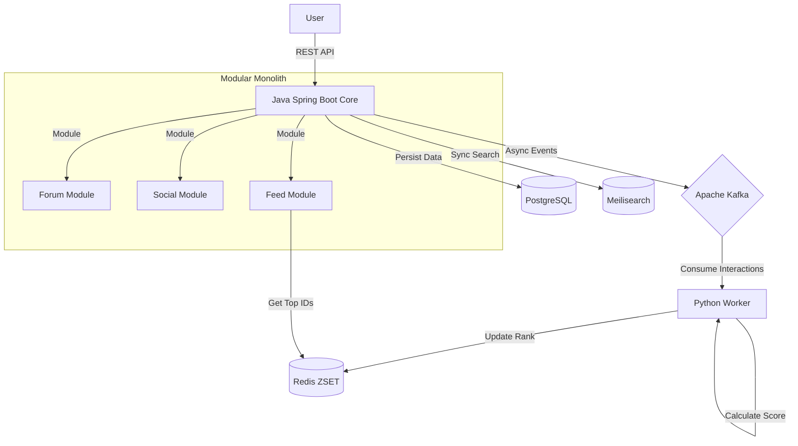

# TECHNICAL DESIGN DOCUMENT (TDD)

**Project:** Hybrid Social Platform (formerly ThreadIt)  
**Version:** 3.0 (Final Draft: Hybrid Architecture)  
**Status:** Approved
LongDx  
**Last Updated:** December 2025

## 1. TỔNG QUAN HỆ THỐNG (SYSTEM OVERVIEW)

### 1.1. Mục tiêu (Goal)
Xây dựng Backend cho mạng xã hội hiện đại (Social Media), tập trung vào các cộng đồng (Communities) được phân loại linh hoạt bằng hệ thống Tags (giống Twitter/Manga).
Hệ thống phải đảm bảo tính mở rộng (Scalability), chịu tải cao (High Concurrency) và trải nghiệm người dùng mượt mà.

### 1.2. Phạm vi (Scope)
*   User Identity (Dual-Key: Internal TSID & Public NanoID)
*   Community Management (Tag-Based Classification)
*   Content Delivery (Gravity Feed Algorithm)
*   Interaction (Smart Tagging & Notifications)
*   **Global Accessibility:** Hỗ trợ định danh và tìm kiếm người dùng đa ngôn ngữ (bao gồm cả CJK - Trung/Nhật/Hàn).
*   **Scalability:** Kiến trúc sẵn sàng mở rộng lên 1M+ users (Database Sharding & Caching ready).

---

## 2. KIẾN TRÚC HỆ THỐNG (SYSTEM ARCHITECTURE)

Hệ thống sử dụng mô hình Monolithic Architecture (được module hóa chặt chẽ), sẵn sàng tách thành Microservices khi cần thiết.

### 2.1. Tech Stack (Công nghệ lõi)

| Hạng mục | Công nghệ | Phiên bản | Lý do lựa chọn |
| :--- | :--- | :--- | :--- |
| **Backend Core** | **Java Spring Boot** | 3.4.x | Modular Monolith, High Concurrency. |
| **Worker (AI/Algo)** | **Python** | 3.11+ | Xử lý thuật toán "Gravity" và các tác vụ Data nặng. |
| **Message Broker** | **Apache Kafka** | 3.x | Cầu nối bất đồng bộ giữa Java (User Actions) và Python (Processing). |
| **Database** | PostgreSQL | 16 | Lưu trữ bền vững (Forum + Social Data). |
| **Caching/Rank** | Redis (ZSET) | 7 | Lưu trữ BXH, Feed Pools (70-20-10 Rule). |
| **Search Engine** | Meilisearch | 1.5 | Tìm kiếm tốc độ cao (<50ms). |
| **Migration** | Flyway | Latest | Code First DB Migration. |

### 2.2. High-Level Architecture Diagram

---

## 3. THIẾT KẾ CƠ SỞ DỮ LIỆU (DATABASE DESIGN)

### 3.1. Chiến lược ID (ID Strategy)

Sử dụng chiến lược Dual-Key Identification (Định danh kép) để tối ưu hóa cả Hiệu năng máy và Trải nghiệm người dùng.

> [!TIP]
> Chi tiết triển khai hệ thống định danh thông minh (Hybrid: Latinized Prefix + NanoID Suffix) có thể xem tại [user-identity-spec.md](file:///Users/techmax/Documents/GitHub/forum-backend/docs/user-identity-spec.md).

**Internal ID (Dùng cho Máy):**
*   **Công nghệ:** TSID (Time-Sorted Unique Identifier).
*   **Kiểu dữ liệu:** BIGINT (64-bit).
*   **Lợi ích:** Tương thích hoàn hảo với B-Tree Index của PostgreSQL, không gây phân mảnh trang (Page Splitting) như UUID, sắp xếp được theo thời gian.

**Public ID (Dùng cho Người):**
*   **User Tag:** `LatinizedName` + `#` + `NanoID`. (Ví dụ: `LL#Xy9z` cho user "李小龙").
*   **Cấu trúc:** Prefix (xử lý bởi ICU4J) giúp dễ đọc + Suffix (NanoID) đảm bảo duy nhất và bảo mật.
*   **Lợi ích:** URL thân thiện, hỗ trợ tìm kiếm toàn cầu, đồng thời bảo vệ quyền riêng tư (Suffix ngẫu nhiên).

### 3.2. Schema & Modules Design

Hệ thống chia làm 2 phân hệ dữ liệu:

**A. Phân hệ Forum (Knowledge Base - 3 Layers):**
*   `categories` (id, name): Danh mục lớn (VD: Công nghệ).
*   `sub_forums` (id, category_id, name): Chủ đề cụ thể (VD: Java Backend).
*   `forum_threads` (id, sub_forum_id, title, content, last_activity_at): Bài thảo luận sâu.

**B. Phân hệ Social (Network - Unified):**
*   `communities` (id, name, public_id): Nhóm sinh hoạt chung.
*   `posts` (id, user_id, community_id, content, viral_score):
    *   `community_id` is NULL -> **Personal Post**.
    *   `community_id` NOT NULL -> **Community Post**.

**C. Common Identity & Interaction:**
*   `users` (id, public_id, email, ...).
*   `saved_posts` (user_id, post_id, saved_at):
    *   **PK (Composite):** `(user_id, post_id)` - Mỗi người chỉ lưu 1 bài 1 lần.
    *   **Purpose:** Quản lý Bookmark và tính điểm trọng số cao (8 điểm).
*   **`user_follows` (follower_id, target_id, created_at):**
    *   **Type:** Internal TSID (BIGINT). *Luôn dùng ID nội bộ để join bảng cho nhanh.*
    *   **PK (Composite):** `(follower_id, target_id)`.
    *   **Logic:**
        *   `follower_id`: Người đi theo dõi (User A).
        *   `target_id`: Người được theo dõi (User B).
    *   **Index:**
        *   `idx_follower`: Lấy danh sách đang follow (để Build Feed).
        *   `idx_target`: Lấy danh sách người theo dõi (để tính Count/Notify).

> [!TIP]
> Chi tiết chiến lược URL đẹp (Slug + Short ID) xem tại [url-identity-spec.md](file:///Users/techmax/Documents/GitHub/forum-backend/docs/url-identity-spec.md).

---

## 4. TÍNH NĂNG KỸ THUẬT LÕI (CORE ENGINEERING FEATURES)

### 4.1. Hybrid User Tagging (Smart Global Search)

Kết hợp giữa khả năng tìm kiếm thông minh và bảo mật riêng tư.

*   **Input:** User đặt tên "甘米らくれ".
*   **Processing:**
    1.  **Prefix:** Dùng IBM ICU4J -> Latin hóa -> "GR" (Gợi nhớ).
    2.  **Suffix:** Sinh NanoID ngẫu nhiên -> "7x9A" (Bảo mật).
*   **Output (User Tag):** `GR#7x9A`.
*   **Kết quả:**
    *   User quốc tế dễ dàng gọi tên (@GR...).
    *   Hệ thống bảo mật vì Suffix là ngẫu nhiên, không lộ ID thật.

### 4.2. Gravity Feed Algorithm (Thuật toán xếp hạng)

Sử dụng công thức Gravity Decay (tương tự HackerNews) để tạo Newsfeed "Trending".

$$Score = \frac{(Votes - 1)}{(Time_{hours} + 2)^{1.8}}$$

> [!IMPORTANT]
> Phiên bản nâng cấp **Heart-Based Ranking** (Thả tim thay cho Vote) và các tín hiệu tương tác nâng cao được mô tả chi tiết tại [ranking-algorithm-spec.md](file:///Users/techmax/Documents/GitHub/forum-backend/docs/ranking-algorithm-spec.md).

*   **Cơ chế:**
    *   Khi có Vote mới -> Tính lại Score -> Cập nhật vào Redis Sorted Set (ZSET).
    *   Khi User lướt Feed -> Lấy Top ID từ Redis -> Query chi tiết từ PostgreSQL.
*   **Hiệu năng:** Giảm tải 90% việc sort DB cho PostgreSQL.

---

### 4.3. Sensitive Content Control (NSFW System)

Hệ thống hỗ trợ kiểm soát nội dung nhạy cảm (18+) cho Web Platform.

*   **User Settings:** Cho phép User bật/tắt chế độ xem nội dung nhạy cảm.
*   **Content Labeling:** Gắn cờ `is_nsfw` cho Cộng đồng và Bài viết.
*   **View Logic:** Hiển thị mờ (Blur) và cảnh báo nếu User chưa bật setting.

> [!TIP]
> Xem chi tiết luồng xử lý và thiết kế DB tại [sensitive-content-control-spec.md](file:///Users/techmax/Documents/GitHub/forum-backend/docs/sensitive-content-control-spec.md).

### 4.4. Tag-Based Classification System

Thay thế cấu trúc Sub-forum cứng nhắc bằng hệ thống Tags linh hoạt.

*   **System Tags:** Admin định nghĩa danh mục lớn (Technology, Funny, NSFW).
*   **User Tags:** User tự tạo hashtag (#hanoi, #drama).
*   **Contextual Search:** Tìm kiếm kết hợp (Tag bài viết + Tag cộng đồng).

> [!TIP]
> Chi tiết xem tại [tag-based-classification-spec.md](file:///Users/techmax/Documents/GitHub/forum-backend/docs/tag-based-classification-spec.md).

### 4.5. High-Performance Search Engine

Sử dụng **Meilisearch** để cung cấp khả năng tìm kiếm tức thì (<50ms).

*   **Features:** Typo tolerance, Faceted Search (lọc theo Tag/NSFW), Sorting.
*   **Sync Strategy:** Hybrid CQRS (Async sync từ PostgreSQL -> Meilisearch).
*   **Search Scope:** Title, Content Preview, Tags, Author, Community.

> [!TIP]
> Xem chi tiết cấu hình Index và API tại [search-engine-spec.md](file:///Users/techmax/Documents/GitHub/forum-backend/docs/search-engine-spec.md).

### 4.6. URL Identity System (SEO Friendly)

Hệ thống sử dụng cơ chế **Slug + Short ID** để tạo URL thân thiện và bền vững.

*   **Format:** `/c/{readable-slug}.{short-id}` (VD: `/c/yeu-meo.Xy9z`).
*   **Logic:** Hệ thống query bằng Short ID (Unique), bỏ qua Slug.
*   **Canonical:** Tự động Redirect 301 nếu Slug trên URL sai lệch so với Slug trong DB.

> [!TIP]
> Xem chi tiết thuật toán sinh Short ID và cấu hình Router tại [url-identity-spec.md](file:///Users/techmax/Documents/GitHub/forum-backend/docs/url-identity-spec.md).

## 5. BẢO MẬT (SECURITY & COMPLIANCE)

*   **Authentication:** Stateless JWT (Access Token + Refresh Token).
*   **Password:** Bcrypt Hashing (Cost factor 10-12).
*   **API Protection:**
    *   **Rate Limiting:** Sử dụng Bucket4j để giới hạn request (tránh Spam/DDoS).
    *   **Input Validation:** @Valid annotations check data đầu vào chặt chẽ.
    *   **CORS:** Cấu hình chặt chẽ chỉ cho phép Domain Frontend truy cập.

---

## 6. QUY TRÌNH PHÁT TRIỂN (DEVELOPMENT WORKFLOW)

Để đảm bảo code clean và dễ bảo trì (theo chuẩn Bank):

1.  **Code First Approach:** Viết Java Entity trước.
2.  **Versioning:** Sử dụng Flyway để tạo file migration (V1__Init.sql, V2__Add_Column.sql). Tuyệt đối không dùng `ddl-auto=update` trên môi trường Production.
3.  **Layered Architecture:** Controller -> Service (Interface) -> ServiceImpl -> Repository.
4.  **DTO Pattern:** Luôn dùng DTO (Request/Response) để giao tiếp qua API. Không bao giờ trả trực tiếp Entity ra ngoài (tránh lộ Internal ID hoặc Password).

---

## 7. ĐỊNH HƯỚNG MỞ RỘNG (SCALABILITY ROADMAP)

Khi hệ thống đạt 1 triệu Users:

*   **Read Replicas:** Tách 1 DB Master (Ghi) và 2 DB Slaves (Đọc) cho PostgreSQL.
*   **Partitioning:** Chia bảng `posts` và `comments` theo tháng (Range Partitioning).
*   **Search Engine:** Tích hợp Elasticsearch nếu nhu cầu Full-text search phức tạp hơn.

---
*Tài liệu này được bảo lưu và phát triển bởi LongDx.*
